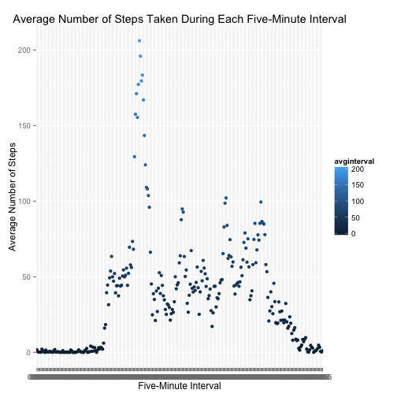
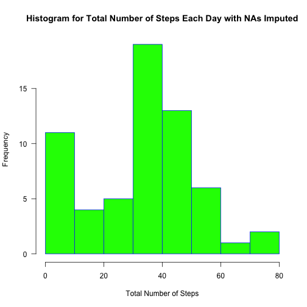
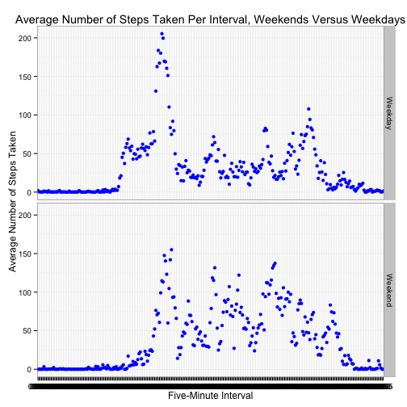

###Make a time series plot of the five-minute interval (x-axis) and the average number of steps taken, averaged across all days.
####I will use ggplot2() instead of plot() because ggplot2() works more easily with tapply().


```r
install.packages("ggplot2", repos = "http://cran.us.r-project.org")
```

```
## Error in install.packages : Updating loaded packages
```

```r
library(ggplot2)
avginterval<-tapply(activity$steps, activity$interval, mean, na.rm=TRUE)
avginterval<-as.data.frame(avginterval)
g<-ggplot(avginterval, aes(row.names(avginterval), avginterval))
p<-g + geom_point(aes(color=avginterval)) + labs(x= "Five-Minute Interval", y = "Average Number of Steps", title = "Average Number of Steps Taken During Each Five-Minute Interval")
par(mar = c(5,4,1,1), las=1)
print(p)
```

 

### Which five-minute interval, on average across all days in the dataset, contains the maximum number of steps? The answer will be the first interval listed in the below dataframe.


```r
head(sort(avginterval$avginterval, decreasing = TRUE))
```

```
##    08:35    08:40    08:50    08:45    08:30    08:20 
## 206.1698 195.9245 183.3962 179.5660 177.3019 171.1509
```

###Calculate and report the total number of missing values in the dataset (i.e., the total number of rows with NAs). (I already checked the date and interval columns and verified that they do not also have NAs)


```r
na<-sum(is.na(activity$steps))
print(na)
```

```
## [1] 2304
```

###Devise a strategy for filling in all of the missing values in the dataset. The strategy does not need to be sophisticated. For example, you could use the mean/median for that day, or the mean for that 5-minute interval, etc. Then create a new dataset that is equal to the original dataset but with the missing data filled in.

####I will calculate the total number of rows in the activity dataframe in order to apply a for loop to replace each of the missing NAs. I will also use the aggregate() function to come up with the median for each five-minute interval,as tapply() has limitations for this purpose.


```r
nrow(activity)
```

```
## [1] 17568
```


```r
mediansteps<-aggregate(steps ~ interval, data = activity, FUN=median, na.rm=TRUE)
replaceNA<-vector()
for (i in 1:17568) {
  nobs<-activity[i,]
  if (is.na(nobs$steps)) {
    steps<-subset(mediansteps, mediansteps$interval == nobs$interval)$steps
  } else {
    steps<-nobs$steps
  }
  replaceNA<-c(replaceNA, steps)
  }
new_activity<-activity
new_activity$steps<-replaceNA
```
###Make a histogram of the total number of steps taken each day and Calculate and report the mean and median total number of steps taken per day. 


```r
totalperday_new<-aggregate(steps ~ date, data = new_activity, FUN=mean)
hist(totalperday_new$steps, main = "Histogram for Total Number of Steps Each Day with NAs Imputed", xlab = "Total Number of Steps", border = "blue", col = "green", xlim = c(0, 80), las=1, breaks = 8)
```

 

###Do these values differ from the estimates from the first part of the assignment? What is the impact of imputing missing data on the estimates of the total daily number of steps?


```r
answer<-c("Yes -- there are fewer steps clustered in the middle of the distribution and more on the edges of the distribution")
print(answer)
```

```
## [1] "Yes -- there are fewer steps clustered in the middle of the distribution and more on the edges of the distribution"
```

###Are there differences in activity patterns between weekdays and weekends? Use the dataset with the filled-in missing values for this part. Create a new factor variable in the dataset with two levels – “weekday” and “weekend” indicating whether a given date is a weekday or weekend day.


```r
new_activity$dayofweek<-weekdays(as.Date(new_activity$date))
day<-vector()
for (i in 1:17568) {
  if (new_activity$dayofweek[i] == "Saturday") {
    day[i]<-"Weekend"
  }else if (new_activity$dayofweek[i] == "Sunday") {
    day[i]<-"Weekend"
  }else {
    day[i]<-"Weekday"
  }
  }
  new_activity$day<-day
```

### Make a panel plot containing a time series plot of the 5-minute interval (x-axis) and the average number of steps taken, averaged across all weekday days or weekend days (y-axis).


```r
total<-aggregate(steps ~ interval + day, data=new_activity, mean)
g<-ggplot(total, aes(interval, steps)) + geom_point(color= "blue") + facet_grid(day~.) + theme_bw() + labs(title = "Average Number of Steps Taken Per Interval, Weekends Versus Weekdays", x = "Five-Minute Interval", y = "Average Number of Steps Taken")
par(mar = c(5,4,1,1), las=1)
print(g)
```

 
